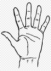

## Hand tracking

> This is the translated content from the original repo, for my changes see below.

### 1. Description of the file
- `palm_detection_without_custom_op.tflite`（Palm detection) model file：[*mediapipe-models*]I downloaded it from the repository.
- `hand_landmark.tflite`（Landmark Detection) model file：[*mediapipe*]I downloaded it from the repository.
- `anchors.csv` with files `hand_tracker.py` File：[*hand_tracking*]I downloaded it from the repository.

### 2. Implementation
```
$ pip install opencv-python tensorflow
$ python run.py
```

### 3. Results


[*mediapipe-models*]: https://github.com/junhwanjang/mediapipe-models/tree/master/palm_detection/mediapipe_models
[*mediapipe*]: https://github.com/google/mediapipe/tree/master/mediapipe/models
[*hand_tracking*]: https://github.com/wolterlw/hand_tracking

---

## My Changes 


### For the research paper behind this model - [Paper Link](https://arxiv.org/abs/2006.10214) or just go to the docs folder

## To Do:

- [x] Add basic control (restricted to 2 options) initially (like using gesture to control up/down scrolling, play pause etc)

- [ ] Make it more accurate

- [ ] Implement an easy-to-use virtual keyboard using gestures

## Done Stuff:

> Be sure to sit a well-lit background (plain for better accuracy). Need to improve this, let's see xP

- Used the awesome model built by MediaPipe and the wrapper made by [metalwhale] to get a basic binary detector with a decent accuracy and two options: Closed fist & Open hand which can be configured in the `actual.py` file to do any keypress using the the pyautogui press/hotkey function.

Just run `actual.py` and make the gestures to the camera

Now, it is set to:

 => Play/Pause Media

 => Go to next track